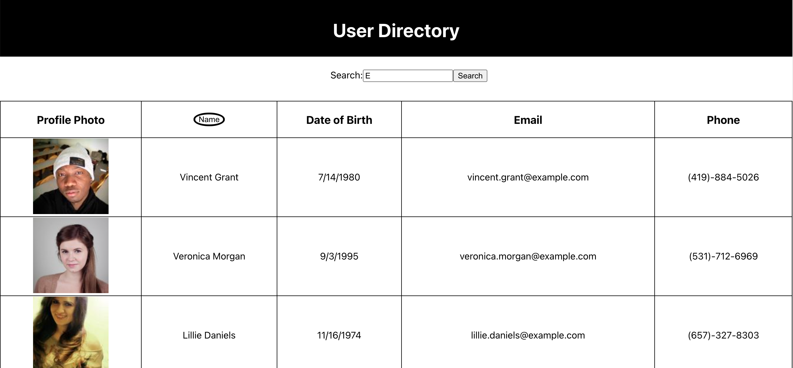

# Unit 19 React Homework: Employee Directory

## Table of Contents
[Description](#description)  
[Installation](#Installation)  
[Test](#Testing)  
[Project Links](#Repo)  
[Contributors](#Contributors)  

## Description
* This app is used to for employee info search. The name button functions as a way to sort from A-Z.

## Installation
* No installations needed.

## Testing
* None available

## Repo
* [Repo](https://github.com/delmymm/Del.Mel-Homework-19-User-Directory)

## Contributors
* Contributor: [Delmy Melendez](https://github.com/delmymm)

